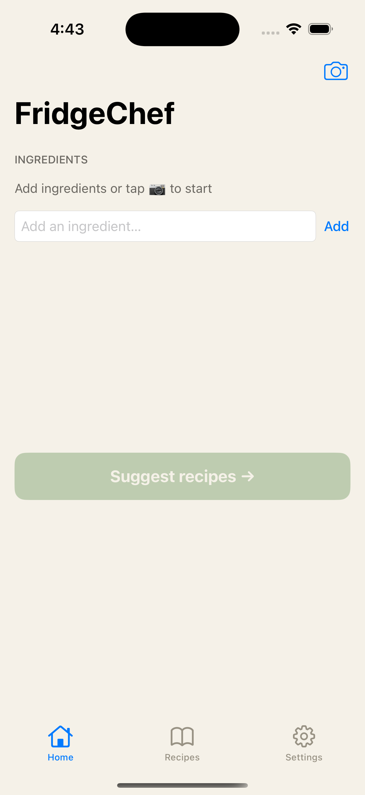
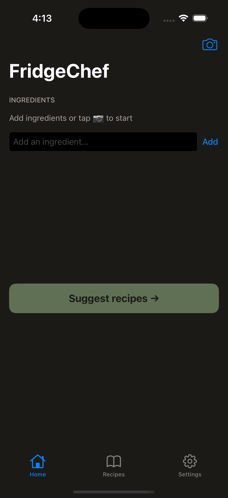
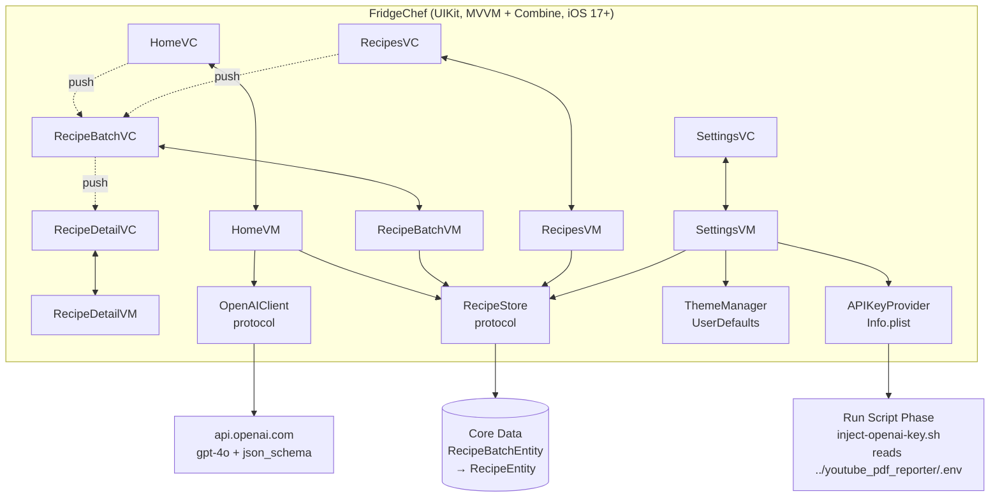
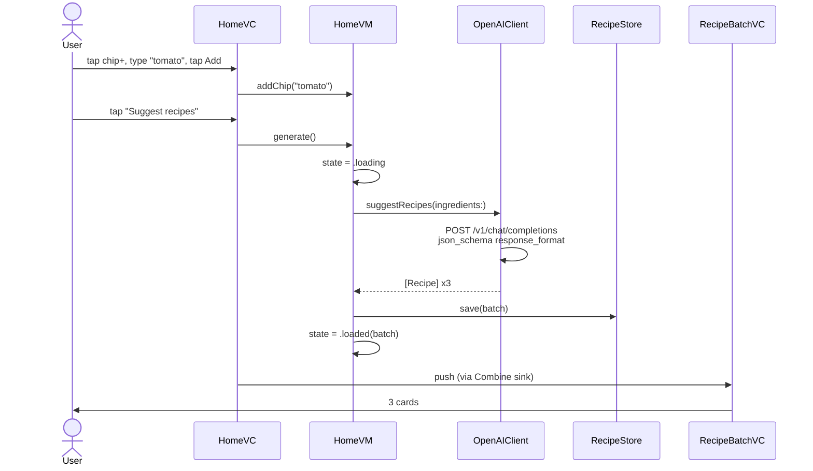

# FridgeChef

> Photograph what's in your fridge, get 3 recipes you can actually cook.

iOS app that turns a list of ingredients — typed as chips or extracted from a photo — into 3 recipe suggestions via GPT-4o Vision. Every batch is saved to a local recipe history. UIKit + MVVM + Core Data, iOS 17+, zero third-party Swift dependencies.

<p align="center">
  
  &nbsp;&nbsp;
  
</p>

---

## Features

- **Chip-based ingredient input** — add ingredients one at a time, lowercased and deduped automatically
- **Photo → ingredients → recipes** — take a photo or pick from the library, GPT-4o Vision reads it and suggests recipes in one round-trip
- **Structured outputs** — uses OpenAI's `response_format: json_schema` so the model returns valid JSON every time, no string parsing
- **Recipe history** — every generated batch persists to Core Data, browsable in a Recipes tab grouped by relative date (Today / Yesterday / This Week / by month)
- **Recipe detail** — full recipe view with ingredients and numbered steps
- **Theme** — Follow System / Light / Dark, persisted in `UserDefaults`
- **Single-key bootstrap** — no setup screen; OpenAI key is read at build time from a sibling project's `.env` and baked into the built `Info.plist`

## Architecture



### Data flow — generate from chips



### Key principles

- Each `ViewController` is a thin shell that binds to a `@Published`-driven `ViewModel` via Combine.
- All networking is `async/await` on `URLSession`, called from `Task {}` inside the VM.
- Every VM stores its in-flight `Task` and cancels it on `deinit` or before starting a new request.
- ViewModels depend on **protocols** (`OpenAIClientProtocol`, `RecipeStoreProtocol`) — concrete implementations are injected via `Dependencies` so they can be stubbed in tests.
- The only persistence layer is Core Data. `RecipeStore` exposes plain Swift structs; the `NSManagedObject` layer is invisible above it.
- Light/dark theme uses `UIColor` dynamic providers — every token has both variants and switches automatically with `overrideUserInterfaceStyle`.

## Tech stack

| Layer | Choice |
|---|---|
| UI | UIKit (no SwiftUI) |
| Architecture | MVVM + Combine + diffable data sources |
| Concurrency | `async/await` + `Task` |
| Networking | `URLSession` direct to `api.openai.com` |
| Persistence | Core Data (in-app sandbox; no iCloud) |
| Min iOS | 17.0 |
| Swift | 5.10+ |
| Project generator | [XcodeGen](https://github.com/yonaskolb/XcodeGen) — `project.yml` is the source of truth |
| Third-party Swift deps | **None** |
| Fonts | Fraunces (display) + DM Sans (body), bundled `.ttf` |
| Tests | XCTest (unit) + XCUITest (smoke) |

## Project structure

```
recipe-ingredients-ios/
├── README.md
├── project.yml                              ← XcodeGen source of truth
├── scripts/inject-openai-key.sh             ← Run Script Phase
├── docs/
│   ├── superpowers/
│   │   ├── specs/2026-05-18-fridgechef-ios-v1-design.md
│   │   └── plans/2026-05-18-fridgechef-ios-v1.md
│   └── screenshots/
└── FridgeChef/
    ├── App/                                 ← AppDelegate, SceneDelegate, RootTabBar, Dependencies
    ├── Features/                            ← one folder per screen, each with View/ + ViewModel/
    │   ├── Home/
    │   ├── RecipeBatch/
    │   ├── RecipeDetail/
    │   ├── Recipes/
    │   └── Settings/
    ├── SharedModels/                        ← Recipe, RecipeBatch (used across features)
    ├── Services/
    │   ├── Networking/                      ← OpenAIClient, OpenAIError, APIKeyProvider, Prompts
    │   ├── Persistence/                     ← CoreDataStack, RecipeStore, .xcdatamodeld, entity extensions
    │   └── Theme/                           ← ThemeManager
    ├── DesignSystem/                        ← Colors, Typography, Spacing, Fonts/
    └── Resources/
FridgeChefTests/
├── Features/                                ← VM tests
├── Services/                                ← OpenAIClient, RecipeStore, APIKeyProvider, ThemeManager
└── Stubs/                                   ← StubOpenAIClient, StubRecipeStore, StubURLProtocol
FridgeChefUITests/
└── SmokeTests.swift                         ← 3 happy-path XCUITest
```

## Design system

Ported from [Spend·book](../personal-finance-tracker-ios) with dark-mode variants.

| Token | Light | Dark | Use |
|---|---|---|---|
| `paper` | `#f5f1e8` | `#1c1a16` | Window background |
| `paper2` | `#efe9dc` | `#26231e` | Card / row surface |
| `ink` | `#2c2a26` | `#f0ece4` | Primary text |
| `inkSoft` | `#6b6862` | `#a8a39a` | Secondary text |
| `rule` | `#ddd7ca` | `#3a3631` | Hairline separators |
| `sage` | `#87a878` | `#a3c594` | Primary accent (Suggest button) |
| `terracotta` | `#c97b5c` | `#e09275` | Destructive / warning |
| `butter` | `#f0e4b8` | `#3e3823` | Chip highlight |

**Typography:** Fraunces 72pt (Regular, Bold) for display, DM Sans (Regular, Medium) for body. Both SIL OFL licensed.

**Spacing scale:** `Spacing.s4` … `Spacing.s48` (4 / 8 / 12 / 16 / 24 / 32 / 48 pt).

## Build + run

### Prerequisites

- Xcode 16+
- Homebrew (for XcodeGen)
- An `OPENAI_API_KEY` line in `~/Desktop/llm-ai-projects/youtube_pdf_reporter/.env`

### From clone to running app

```bash
brew install xcodegen          # one-time, ~10 MB
xcodegen generate              # creates FridgeChef.xcodeproj from project.yml

xcodebuild -project FridgeChef.xcodeproj \
  -scheme FridgeChef \
  -destination 'platform=iOS Simulator,name=iPhone 16 Pro' \
  build

APP_PATH=$(xcodebuild -project FridgeChef.xcodeproj -scheme FridgeChef -configuration Debug \
  -destination 'platform=iOS Simulator,name=iPhone 16 Pro' -showBuildSettings 2>/dev/null \
  | awk -F' = ' '/^ *BUILT_PRODUCTS_DIR/ {print $2}' | head -1)

xcrun simctl install booted "$APP_PATH/FridgeChef.app"
xcrun simctl launch booted com.baha.fridgechef
```

The Run Script Phase reads the `.env` file at build time and bakes `OPENAI_API_KEY` into the built `Info.plist`. The key never enters git.

### Why the build script approach

| Approach | Trade-off |
|---|---|
| **Build script reads sibling repo's .env** (chosen) | Zero manual steps; only works on this laptop |
| Setup sheet → Keychain on first launch | Portable; requires user to paste key |
| Hardcoded in source | Don't |
| Tiny proxy backend | Safest; adds infra |

## Testing

```bash
xcodebuild -project FridgeChef.xcodeproj -scheme FridgeChef \
  -destination 'platform=iOS Simulator,name=iPhone 16 Pro' test
```

| Layer | Tool | Tests |
|---|---|---|
| ViewModels | XCTest | 9 (HomeVM) + 2 (RecipeBatchVM) + 1 (RecipeDetailVM) + 3 (RecipesVM) + 4 (SettingsVM) |
| OpenAIClient | XCTest with `URLProtocol` stub | 10 (request shape, response decode, 4xx/5xx mapping, image variant) |
| RecipeStore | XCTest with in-memory `NSPersistentContainer` | 5 (save/load/byId/deleteAll/ordering) |
| APIKeyProvider | XCTest with custom `Bundle` | 3 (present/missing/empty) |
| ThemeManager | XCTest with custom `UserDefaults` | 4 (default/light/dark/style mapping) |
| UI smoke | XCUITest with launch-arg stub injection | 3 (one per tab — UI elements present) |

**Total:** 43 unit tests + 3 UI smoke = **46 tests.**

The end-to-end Home generate→push flow is exercised by `HomeVMTests` + `RecipeBatchVMTests` rather than XCUITest, because keyboard timing and navigation animations make the XCUITest version flaky in simulator.

### Pre-commit secret-scan hook

A `.git/hooks/pre-commit` script blocks any commit whose staged diff contains an OpenAI / Anthropic / AWS / GitHub PAT / Google API key pattern. Bypass with `git commit --no-verify` if you ever need to. Hooks aren't versioned by git — re-install on fresh clones.

## What's deferred to v2

- Favoriting / starring individual recipes
- Editing saved recipes
- Share sheet on recipe detail
- Crash reporting (Sentry SDK)
- iPad bespoke layout, Mac Catalyst
- Dietary filters (vegetarian, gluten-free, allergens)
- Cooking timer / step-by-step mode
- Backend proxy for the OpenAI key
- iCloud sync of recipe history
- Multi-language

## Design + plan docs

- 📐 **[Design spec](docs/superpowers/specs/2026-05-18-fridgechef-ios-v1-design.md)** — the full architectural decisions, screen mocks, error handling, testing strategy
- 🛠 **[Implementation plan](docs/superpowers/plans/2026-05-18-fridgechef-ios-v1.md)** — 11 phases, 56 tasks, every task with code blocks and exact commands

## License

Personal project — no license. Don't redistribute the bundled `OPENAI_API_KEY` if you fork.
