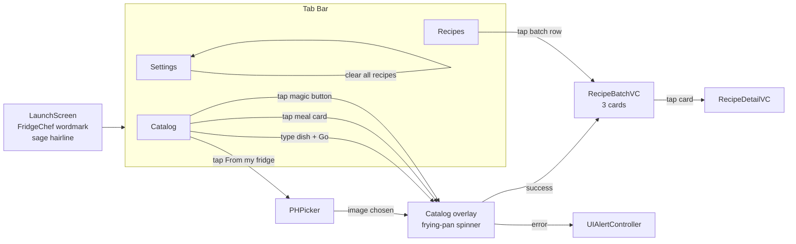
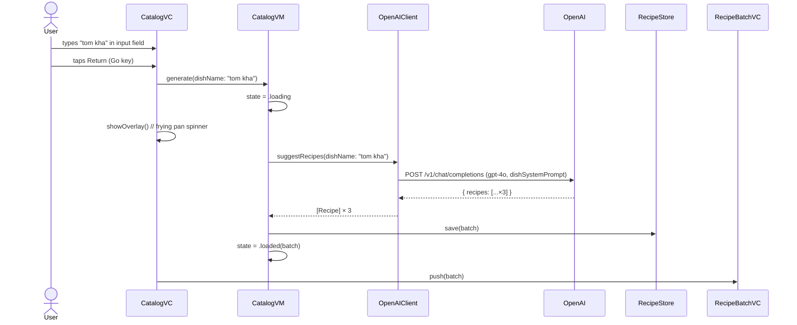
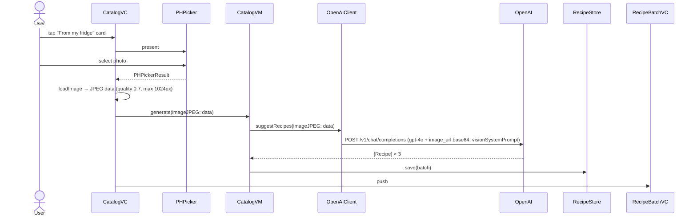
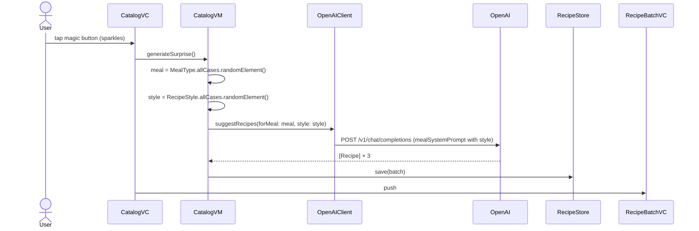
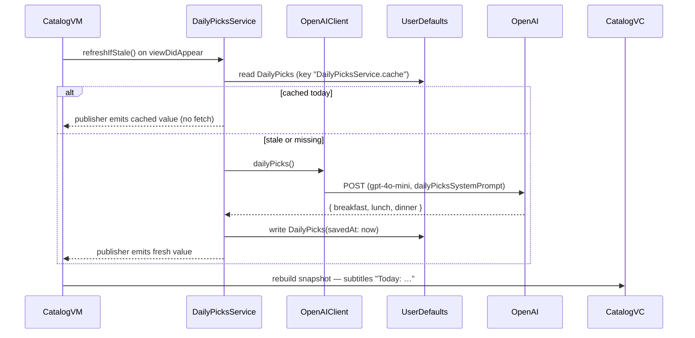
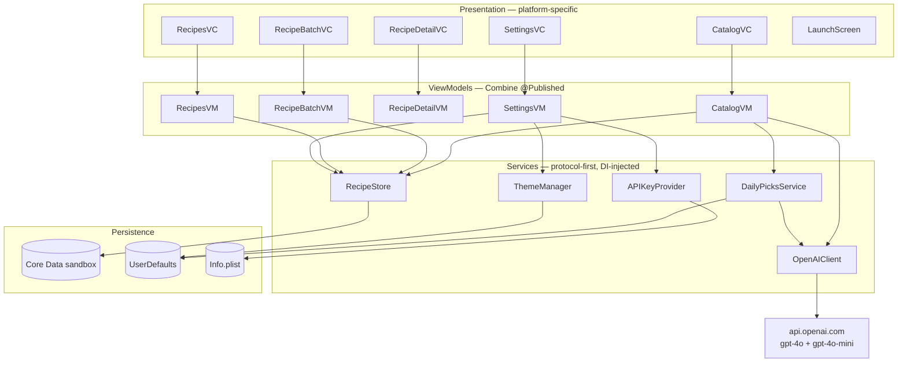

# FridgeChef — Cross-Platform Porting Spec

> Single source of truth for rebuilding FridgeChef on **Android (Jetpack Compose)**, **Flutter**, **React Native**, or **.NET MAUI**. Every screen, dimension, color, font, icon, prompt, network call, and persistence schema is recorded here so the iOS reference is reproducible elsewhere without reading Swift code.

**Reference implementation:** `~/Desktop/llm-ai-projects/recipe-ingredients-ios/`
**Reference platform:** iOS 17+, UIKit, MVVM + Combine, Core Data
**Last reconciled with code:** 2026-05-19

---

## 1. App at a glance

FridgeChef is a single-purpose recipe assistant. From the Home (Catalog) tab a user can:

1. Type a dish name → get 3 variations from GPT-4o
2. Tap a meal-idea card (Breakfast / Lunch / Dinner) → get 3 recipes for that meal
3. Tap **From my fridge** → pick or take a photo → GPT-4o Vision reads it and returns 3 recipes
4. Tap the **magic** button → get 3 random recipes (random meal × random style)

Each generated batch lands on a `RecipeBatch` screen (3 cards), tapping a card opens `RecipeDetail`. Batches persist locally and are browsable in the Recipes tab. A Settings tab handles theme + API key status.

There is **no account, no backend, no cloud sync**. The OpenAI key is baked into the build at compile time. All persistence is local.

---

## 2. Screen map



Five distinct screens (plus the modal photo picker and the alert):

| Screen | Owning VC | Tab | Notes |
|---|---|---|---|
| Recipe Catalog | `CatalogVC` | Home (1st) | Always the entry point |
| Recipes history | `RecipesVC` | Recipes (2nd) | Sectioned list of past batches |
| Settings | `SettingsVC` | Settings (3rd) | Theme, key status, clear-all |
| Recipe Batch | `RecipeBatchVC` | (pushed) | 3 cards from one generation |
| Recipe Detail | `RecipeDetailVC` | (pushed) | Full recipe |

The tab bar uses **outline SF Symbols**: `house`, `square.grid.2x2`, `slider.horizontal.3` — see §7 for cross-platform equivalents.

---

## 3. User flows

### 3.1 Flow A — type a dish



### 3.2 Flow B — tap a meal idea card

Identical to A except call is `suggestRecipes(forMeal: .breakfast, style: nil)` and the prompt is `mealSystemPrompt(meal:.breakfast, style:nil)`.

### 3.3 Flow C — From my fridge (photo → vision)



### 3.4 Flow D — magic surprise



### 3.5 Flow E — daily picks (background)



Failure is silent: if the fetch errors, cards keep showing whatever was last cached (or "Loading…" until first success).

---

## 4. Design system

### 4.1 Color palette (light / dark — every color has both variants)

| Token | Light hex | Dark hex | RGB (0-1, light) | Used for |
|---|---|---|---|---|
| `paper` | `#F5F1E8` | `#1C1A16` | 0.961 / 0.945 / 0.910 | Window & nav background |
| `paper2` | `#EFE9DC` | `#26231E` | 0.937 / 0.914 / 0.863 | Card / row surface |
| `ink` | `#2C2A26` | `#F0ECE4` | 0.173 / 0.165 / 0.149 | Primary text |
| `inkSoft` | `#6B6862` | `#A8A39A` | 0.420 / 0.408 / 0.384 | Secondary text |
| `rule` | `#DDD7CA` | `#3A3631` | 0.867 / 0.843 / 0.792 | Hairline separators, card borders |
| `sage` | `#87A878` | `#A3C594` | 0.529 / 0.659 / 0.471 | Primary accent (LaunchScreen hairline, success indicators, time label) |
| `terracotta` | `#C97B5C` | `#E09275` | 0.788 / 0.482 / 0.361 | Magic button background, destructive actions, badges |
| `butter` | `#F0E4B8` | `#3E3823` | 0.941 / 0.894 / 0.722 | Reserved for chip highlight (unused in v1.1 catalog) |

Light/dark switching is automatic: every UIColor token is a dynamic provider that resolves based on `traitCollection.userInterfaceStyle`. On other platforms, register two flavors and swap based on system appearance or stored preference (`ThemeManager`, §10).

### 4.2 Typography

Two font families. Both **SIL OFL** licensed, ship in `FridgeChef/DesignSystem/Fonts/`:

| Family | File | Use |
|---|---|---|
| **Fraunces 72pt** (Regular, Bold) | `Fraunces72pt-Regular.ttf`, `Fraunces72pt-Bold.ttf` | Display, titles, large numbers |
| **DM Sans** (Regular, Medium) | `DMSans-Regular.ttf`, `DMSans-Medium.ttf` | Body, caption, table cells |

Logical type ramp (every named role used in the app):

| Role | Family + weight | Size (pt) | Used at |
|---|---|---|---|
| `largeTitle` | Fraunces 72pt Bold | 34 | "Recipe Catalog" header on CatalogVC |
| `title` | Fraunces 72pt Bold | 22 | CategoryCardCell title ("Breakfast ideas") |
| `bigNumber` | Fraunces 72pt Bold | 48 | Reserved (no current screen) |
| `bodyLg` | DM Sans Regular | 17 | Reserved (currently used implicitly in some Apple-styled cells) |
| `body` | DM Sans Regular | 15 | Catalog input placeholder, card subtitles, loading overlay text |
| `caption` | DM Sans Medium | 13 | Helper text under input, magic button helper, RecipeBatch header |
| `micro` | DM Sans Medium | 11 | Reserved |

Ad-hoc sizes used outside the ramp (recipe surfaces):

| Screen | Element | Font | Size |
|---|---|---|---|
| `RecipeBatchCardCell` | title | Fraunces 72pt Bold | 20 |
| `RecipeBatchCardCell` | description | DM Sans Regular | 14 |
| `RecipeBatchCardCell` | badges | DM Sans Medium | 12 |
| `RecipeBatchCardCell` | time | DM Sans Medium | 12 |
| `RecipeBatchVC` | header | DM Sans Medium | 12 |
| `RecipeDetailVC` | title | Fraunces 72pt Bold | 32 |
| `RecipeDetailVC` | time | DM Sans Medium | 13 |
| `RecipeDetailVC` | section header | Fraunces 72pt Bold | 22 |
| `RecipeDetailVC` | body text | DM Sans Regular | 16 |
| `RecipesBatchCell` | primary | DM Sans Medium | 16 |
| `RecipesBatchCell` | secondary | DM Sans Regular | 13 |
| `RecipesVC` | section header | DM Sans Medium | 12 |

**Launch screen exception:** `FridgeChef` wordmark renders in **Fraunces 72pt Bold @ 44pt**. iOS pre-registers `UIAppFonts` so the storyboard label can resolve `Fraunces72pt-Bold`. On platforms where the launch screen can't load custom fonts, substitute a serif system font (Android: `serif-monospace`/`Roboto Serif`, Flutter: `Theme.of(context).textTheme.displayLarge` with a serif), or render a bundled SVG/PNG wordmark.

### 4.3 Spacing scale

A single 8pt-ish ramp. Every layout constraint in the app references one of these names — there are **no raw integer constants** sprinkled in layout code (the only exceptions are component-intrinsic dimensions like card corner radius).

| Token | Value (pt) | Used at |
|---|---|---|
| `s4` | 4 | Input → helper-label gap; RecipeBatchCardCell internal stack |
| `s8` | 8 | Magic button → magic helper gap; spinner → label gap; RecipeBatchVC header inset |
| `s12` | 12 | RecipeBatch inter-group spacing (card-to-card) |
| `s16` | 16 | CategoryCardCell padding; RecipeBatchCardCell padding; RecipeDetail internal spacing |
| `s24` | 24 | Catalog scrollview content insets; CatalogVC stack spacing; RecipeDetail outer margin |
| `s32` | 32 | RecipeBatch section top inset |
| `s48` | 48 | Reserved |

### 4.4 Component dimensions (hard-coded, non-token)

| Component | Dimension | Value |
|---|---|---|
| CategoryCardCell | corner radius | 12 pt (continuous curve) |
| CategoryCardCell | height (in 2×2 grid) | 140 pt |
| CategoryCardCell | item inset (each side) | 6 pt |
| CategoryCardCell | section inset (lateral) | 10 pt |
| Magic button | diameter | 56 pt (radius 28) |
| Magic button icon | size | 24 pt semibold |
| RecipeBatchCardCell | corner radius | 12 pt |
| RecipeBatchCardCell | border width | 1 pt (color `rule`) |
| Loading-overlay frying pan | size | 56 pt regular |
| Loading-overlay backdrop | color | `ink` @ 60% alpha |
| Catalog collection view | total height (2 rows × 140 + insets) | **292 pt** |
| Launch screen wordmark | font size | 44 pt |
| Launch screen sage hairline | size | 60 × 2 pt |
| Launch screen hairline gap | below wordmark | 20 pt |

---

## 5. Component inventory

### 5.1 `CategoryCardCell` (catalog grid item)

| Property | Spec |
|---|---|
| Container | `UICollectionViewCell` with `paper2` background, 12pt continuous corner |
| Title label | `Typography.title` (Fraunces 22 bold), color `ink`, max 2 lines |
| Subtitle label | `Typography.body` (DM Sans 15), color `inkSoft`, max 2 lines |
| Title inset | 16 / 16 / 16 from top / leading / trailing |
| Subtitle inset | 16 from bottom; aligns leading/trailing to title |
| Configure for meal | `title = "Breakfast ideas"`, `subtitle = "Today: <pick>"` or `"Loading…"` if pick nil |
| Configure for fridge | `title = "From my\nfridge"`, `subtitle = "Snap a photo"` |
| Accessibility ID | `catalog.card.breakfast` / `.lunch` / `.dinner` / `.fridge` |

### 5.2 `CatalogVC` (Home tab)

Vertical stack inside a scroll view. Order top-to-bottom:

1. Input block — `UITextField` ("How to cook…", `body`) + helper label ("Enter the name of any dish", `caption`/`inkSoft`); 4pt internal gap
2. Section header — "Recipe Catalog" (`largeTitle`/`ink`)
3. Collection view — 292pt tall, fixed; 2 rows × 2 columns; `UICollectionViewCompositionalLayout` with each item `fractionalWidth(0.5)`, group height `absolute(140)`, item inset 6pt, section inset 10pt lateral
4. Magic block — terracotta 56pt circle button (`sparkles` symbol) above a 2-line center-aligned helper ("Can't decide what to cook? / Just press the button"); 8pt internal gap

Outer stack spacing: 24pt. Scroll view inset: 24pt on all four sides.

### 5.3 `RecipeBatchCardCell` (recipe in a batch)

| Property | Spec |
|---|---|
| Background | `paper2`, 12pt corner, 1pt `rule` border |
| Title | Fraunces 20 bold, `ink` |
| Description | DM Sans 14, `inkSoft` |
| Badges (ingredient count) | DM Sans 12 medium, `terracotta` |
| Time | DM Sans 12 medium, `sage` |
| Internal stack | vertical, 4pt spacing, 16pt all-around inset |

### 5.4 Magic button

Circular `UIButton`, 56×56, corner radius 28, background `terracotta`, tint white, content is the `sparkles` SF Symbol at 24pt semibold. Accessibility label "Surprise me", hint "Generate three random recipes".

### 5.5 Loading overlay (catalog)

| Property | Spec |
|---|---|
| Backdrop | Full-screen, color `ink @ 0.6α` |
| Icon | `frying.pan.fill` SF Symbol, fallback `fork.knife`; 56pt regular; tinted `paper` |
| Animation | `CABasicAnimation(keyPath: "transform.rotation.z")`, toValue `2π`, duration 1.6s, repeat infinity |
| Label | "Cooking up ideas…", `body`, color `paper` |
| Stack | vertical, 8pt spacing, centered |

### 5.6 Launch screen

Static. Paper background. Wordmark "FridgeChef" centered (Fraunces 72pt Bold @ 44pt, color `ink`), translated up 20pt from view center. 60×2pt sage hairline directly below the wordmark, 20pt gap.

---

## 6. State machines

### 6.1 `CatalogVM.State`

```
.idle           — initial, no overlay
   ↓ generate*()
.loading        — overlay shown
   ↓ success      ↓ error
.loaded(batch) .error(message)
   ↓ push         ↓ alert dismissed
.idle           .idle
```

Five generation entry points all converge on `private func run(_ fetch: @escaping () async throws -> [Recipe])`:
- `generate(dishName:)`
- `generate(forMeal:style:)`
- `generate(imageJPEG:)`
- `generate(ingredients:)`  ← still callable, vestigial v1 path
- `generateSurprise()` → random meal × random style

`run(_:)` sets `.loading`, awaits the closure, on success saves to `RecipeStore` and emits `.loaded`, on error emits `.error`.

### 6.2 `DailyPicksService` lifecycle

- On first call to `refreshIfStale()` after launch:
  - if cache exists AND `Calendar.current.isDate(savedAt, inSameDayAs: now)` → no fetch, publisher emits the cached `DailyPicks`
  - else → call `OpenAIClient.dailyPicks()`, write to UserDefaults, publisher emits the fresh value
- On error → silent (log internally, publisher does not emit a fresh value; consumers keep last cached or `nil`)

---

## 7. Icon catalog

Every iconographic element is an Apple SF Symbol. None are bundled as images. Five icons total.

| Where | SF Symbol (iOS) | Material Symbol (Android) | Lucide (web/RN) | Notes |
|---|---|---|---|---|
| Home tab bar | `house` | `home` | `home` | Outlined |
| Recipes tab bar | `square.grid.2x2` | `grid_view` | `layout-grid` | Outlined |
| Settings tab bar | `slider.horizontal.3` | `tune` | `sliders-horizontal` | Outlined |
| Magic button | `sparkles` | `auto_awesome` | `sparkles` | Filled-style on terracotta circle |
| Loading overlay | `frying.pan.fill` (fallback `fork.knife`) | `outdoor_grill` / `restaurant` | `cooking-pot` / `chef-hat` | Kitchen-themed |

No image assets in `Assets.xcassets` — there is no asset catalog. **All graphic UI elements are either system symbols, dynamic UIColor blocks, or text rendered in Fraunces/DM Sans.** A port can rely on platform-native icon sets without redrawing anything.

---

## 8. API contract

### 8.1 Endpoint

`POST https://api.openai.com/v1/chat/completions`

Headers:
- `Authorization: Bearer <OPENAI_API_KEY>`
- `Content-Type: application/json`

### 8.2 Models used

| Method | Model | Why |
|---|---|---|
| Recipe generation (all four paths) | `gpt-4o` | Quality |
| Daily picks (titles only) | `gpt-4o-mini` | Cheap; just three short strings |

### 8.3 Request shapes

All five methods send `response_format: { type: "json_schema", json_schema: {...} }` with `strict: true` so OpenAI guarantees valid JSON.

**Recipe schema (returned by 4 recipe methods):**

```json
{
  "type": "object",
  "additionalProperties": false,
  "required": ["recipes"],
  "properties": {
    "recipes": {
      "type": "array",
      "minItems": 3,
      "maxItems": 3,
      "items": {
        "type": "object",
        "additionalProperties": false,
        "required": ["title", "description", "ingredients", "steps", "estimatedTime"],
        "properties": {
          "title":         { "type": "string" },
          "description":   { "type": "string" },
          "ingredients":   { "type": "array", "items": { "type": "string" } },
          "steps":         { "type": "array", "items": { "type": "string" } },
          "estimatedTime": { "type": "string" }
        }
      }
    }
  }
}
```

**Daily picks schema:**

```json
{
  "type": "object",
  "additionalProperties": false,
  "required": ["breakfast", "lunch", "dinner"],
  "properties": {
    "breakfast": { "type": "string" },
    "lunch":     { "type": "string" },
    "dinner":    { "type": "string" }
  }
}
```

### 8.4 System prompts (verbatim — these are the contract with the model)

| Method | Prompt |
|---|---|
| `suggestRecipes(ingredients:)` | `You are a cooking assistant. Given a list of ingredients the user has on hand, suggest exactly 3 recipes the user can make. Prefer recipes that use as many of the provided ingredients as possible. Each recipe must have: a short title, a one-paragraph description, an ingredient list (with rough quantities), step-by-step instructions, and an estimated total time as a short string like "30 min".` |
| `suggestRecipes(imageJPEG:)` | `You are a cooking assistant. The image shows the contents of someone's fridge or pantry. First, identify the visible ingredients. Then suggest exactly 3 recipes the user can make from them. Prefer recipes that use as many of the visible ingredients as possible. Each recipe must have: …(same shape)… Ignore non-edible items in the image.` |
| `suggestRecipes(dishName:)` | `You are a cooking assistant. The user has named a dish they want to cook. Suggest exactly 3 variations of that dish — for example: a classic version, a healthier/lighter version, and a fancy/restaurant-style version. Each recipe must have: a short title (clearly indicating the variation), …(same shape)…` |
| `suggestRecipes(forMeal:style:)` | `You are a cooking assistant. Suggest exactly 3 <meal> recipes someone could cook today.[ Make them <style fragment>.] Vary the recipes — don't give three nearly-identical dishes. Each recipe must have: …(same shape)…` |
| `dailyPicks()` | `You are a cooking assistant. Suggest one specific recipe title (just the title, no description) for each meal type today: breakfast, lunch, and dinner. Pick recipes that are interesting but achievable in a normal home kitchen. Titles should be short and concrete — for example: "Avocado toast with poached egg" not "A delicious breakfast option". Return JSON with keys breakfast, lunch, dinner.` |

Meal display names (used in the prompt and on cards): `breakfast` / `lunch` / `dinner`.

Style fragments (random pick for magic button): `quick and easy`, `comforting`, `healthy`, `restaurant-style`, `one-pot`, `vegetarian`.

### 8.5 Image encoding (Flow C)

iOS encodes the JPEG (quality 0.7, max edge 1024px) as base64 and sends it inside a `content` array:

```json
{
  "role": "user",
  "content": [
    { "type": "text", "text": "(empty or user note)" },
    { "type": "image_url", "image_url": { "url": "data:image/jpeg;base64,<...>" } }
  ]
}
```

### 8.6 Errors

The client maps:
- HTTP 401 → `OpenAIError.unauthorized` ("Check your OpenAI API key.")
- HTTP 4xx (non-401) → `.client(message)`
- HTTP 5xx → `.server`
- Decoding failure → `.decoding`
- Network → `.transport(underlying)`

UI surfaces all errors as a single-button `UIAlertController`.

---

## 9. Persistence contract

Local-only. No cloud sync.

### 9.1 Core Data → portable schema

Two entities. Translate as two SQLite tables on Android / Flutter / RN (e.g. Room, Drift, WatermelonDB):

**`recipe_batch`**

| Column | Type | Required | Notes |
|---|---|---|---|
| `id` | UUID | yes | PK |
| `created_at` | Date/timestamp | yes | Used for grouping in Recipes tab |
| `input_ingredients_json` | TEXT (JSON `[String]`) | yes | Empty `[]` if generation was from dish name / meal / image |
| `input_image_thumbnail_jpeg` | BLOB | optional | Stored if generation was from a fridge photo |

**`recipe`**

| Column | Type | Required | Notes |
|---|---|---|---|
| `id` | UUID | yes | PK |
| `batch_id` | UUID FK → `recipe_batch.id` | yes | Cascade delete |
| `title` | TEXT | yes | |
| `recipe_description` | TEXT | yes | |
| `ingredients_json` | TEXT (JSON `[String]`) | yes | |
| `steps_json` | TEXT (JSON `[String]`) | yes | |
| `estimated_time` | TEXT | yes | Free-form ("30 min", "1 hour") |
| `order` | Int16 | yes | Display order within batch (0..2) |

Ordering: `recipes` is an *ordered* relationship; preserve via the `order` column.

### 9.2 UserDefaults / preferences

| Key | Type | Notes |
|---|---|---|
| `DailyPicksService.cache` | JSON-encoded `DailyPicks` | `{ breakfast?, lunch?, dinner?, savedAt }` |
| `ThemeManager.themePreference` | Int (0/1/2) | Follow system / Light / Dark |

On Android: `SharedPreferences` / `DataStore`. On Flutter: `shared_preferences`. On RN: `AsyncStorage` or MMKV.

### 9.3 OpenAI key

Bundled into the binary at build time via a Run Script Phase that reads `~/Desktop/llm-ai-projects/youtube_pdf_reporter/.env::OPENAI_API_KEY` and writes it into the *built* `Info.plist`. The source `Info.plist` has an empty value; the script populates `$BUILT_PRODUCTS_DIR/.../Info.plist`. The key never enters git.

On other platforms:
- Android: Gradle reads `local.properties`, writes `BuildConfig.OPENAI_API_KEY` (gitignored)
- Flutter: `--dart-define=OPENAI_API_KEY=…` flag, or `flutter_dotenv` (gitignored)
- RN: `react-native-config` with a gitignored `.env`

---

## 10. Theme system

Three states: **system / light / dark**, stored in preferences.

| State | iOS | Android | Flutter | React Native |
|---|---|---|---|---|
| Follow system | `overrideUserInterfaceStyle = .unspecified` | `MODE_NIGHT_FOLLOW_SYSTEM` | `ThemeMode.system` | `Appearance.getColorScheme()` |
| Light | `.light` | `MODE_NIGHT_NO` | `ThemeMode.light` | force `'light'` |
| Dark | `.dark` | `MODE_NIGHT_YES` | `ThemeMode.dark` | force `'dark'` |

Every color token has both variants (§4.1). Switch is instant, no per-screen layout swap needed.

---

## 11. Tooling reference

| Concern | iOS reference | Android equivalent | Flutter equivalent | React Native equivalent |
|---|---|---|---|---|
| Project generator | XcodeGen (`project.yml`, `.xcodeproj` gitignored) | Gradle (kts preferred) | `pubspec.yaml` + flavors | `app.json` + EAS |
| UI framework | UIKit | Jetpack Compose | Flutter widgets | React Native (Expo or bare) |
| Architecture | MVVM + Combine + diffable data sources | MVVM + StateFlow + LazyColumn/LazyVerticalGrid | MVVM + Riverpod/BLoC + ListView/GridView | MVVM + Zustand/Redux + FlatList |
| Concurrency | `async/await` + `Task` | Coroutines + `viewModelScope` | `Future`/`async` + `compute` | `async`/`await` + AbortController |
| Networking | `URLSession` direct, JSON via `JSONDecoder` | Ktor or OkHttp + kotlinx.serialization | `package:http` or `dio` | `fetch` |
| Persistence | Core Data (in-app sandbox) | Room | Drift or `sqflite` | WatermelonDB or `expo-sqlite` |
| Photo picker | `PHPickerViewController` | `ActivityResultContracts.PickVisualMedia` | `image_picker` | `expo-image-picker` |
| Local image compress | `UIGraphicsImageRenderer` + `.jpegData(0.7)` | `Bitmap.compress(JPEG, 70)` | `flutter_image_compress` | `expo-image-manipulator` |
| Launch screen | `LaunchScreen.storyboard` | `splashScreen` API (Android 12+) | `flutter_native_splash` | `expo-splash-screen` |
| Min platform | iOS 17.0 | Android 9 (API 28) — for kitchen icons | Flutter 3.16+ | RN 0.74 / Expo SDK 50+ |
| Pre-commit secret scan | `.git/hooks/pre-commit` blocks `sk-…`, `AKIA…`, `ghp_…`, `AIza…` | (port the same shell hook) | (same) | (same) |

---

## 12. Architecture overview



**Dependency rules:**

1. Views never reach services directly — they only know their own VM.
2. VMs depend on **service protocols**, never concrete classes. Concrete implementations are injected by a top-level `Dependencies` container.
3. Services know nothing about UIKit; they're pure value-in / value-out.
4. Tests substitute stubs (`StubOpenAIClient`, `StubRecipeStore`, `StubDailyPicksService`) for the concrete services. The protocol surface is the test boundary.

Adapt this to the target platform's idioms:

| iOS concept | Android (Compose) | Flutter | React Native |
|---|---|---|---|
| `protocol Foo` | `interface Foo` | `abstract class Foo` | TypeScript `interface Foo` |
| `@Published` | `StateFlow<T>` | `ValueNotifier<T>` / Riverpod `StateProvider` | Zustand store / Redux slice |
| Combine `sink` | `collect { }` in lifecycle scope | `addListener` / `Consumer` | `useStore` hook |
| `Task { … }` | `viewModelScope.launch` | `() async { … }()` | `async` IIFE |
| `Dependencies` container | Hilt / Koin | `get_it` / Riverpod | React Context / inversify |

---

## 13. Test coverage targets

A port should match the iOS test count (52 total) shape, not the exact assertions:

| Layer | Tests |
|---|---|
| `CatalogVM` | 6 (text generate / each meal type / image / surprise / error) |
| `DailyPicksService` | 4 (cold fetch / same-day cache hit / next-day refresh / silent error) |
| `OpenAIClient` (URLProtocol-stubbed) | 13 — request shape + response decode + 4xx/5xx mapping for ingredients / image / dishName / forMeal / dailyPicks |
| `RecipeStore` (in-memory) | 5 — save / load / byId / deleteAll / ordering |
| `RecipesVM` | 3 |
| `SettingsVM` | 4 |
| `ThemeManager` (custom prefs) | 4 |
| `APIKeyProvider` (custom bundle) | 3 |
| `RecipeBatchVM` | 2 |
| `RecipeDetailVM` | 1 |
| Smoke / UI | 3 — catalog cards present, recipes empty state, theme toggle |

---

## 14. What stays the same vs what needs platform work

**Same across every port:**
- Prompts (§8.4)
- OpenAI endpoint, models, response schemas (§8)
- Persistence schema (§9)
- Color palette + spacing scale + type ramp (§4)
- User flows + state machine (§3, §6)
- Architecture / dependency rules (§12)

**Platform-specific rewrite:**
- View composition (UIKit → Compose / Flutter / RN)
- Navigation (UINavigationController push → respective navigator)
- Photo picker UX
- Launch screen rendering
- Custom font registration (each platform has its own dance)
- Build-time secret injection

**Where you'll need product judgment:**
- Cooking-themed loading icon — `frying.pan.fill` is iOS-only. Material has `outdoor_grill`, Lucide has `cooking-pot`. The animation (1.6s continuous rotation) translates directly.
- Tab bar vs bottom nav vs nav rail — iOS uses 3-tab `UITabBarController`. Android Compose: `NavigationBar`. Flutter: `BottomNavigationBar`. RN: `@react-navigation/bottom-tabs`.
- Modal vs full-screen photo picker — match the platform convention.

---

## 15. Reference files in the iOS repo

| Topic | Path |
|---|---|
| Colors | `FridgeChef/DesignSystem/Colors.swift` |
| Typography | `FridgeChef/DesignSystem/Typography.swift` |
| Spacing | `FridgeChef/DesignSystem/Spacing.swift` |
| Fonts (TTF) | `FridgeChef/DesignSystem/Fonts/` |
| Catalog screen | `FridgeChef/Features/Catalog/View/CatalogVC.swift`, `CategoryCardCell.swift`, `ViewModel/CatalogVM.swift` |
| Recipe batch screen | `FridgeChef/Features/RecipeBatch/View/RecipeBatchVC.swift`, `RecipeBatchCardCell.swift` |
| Recipe detail | `FridgeChef/Features/RecipeDetail/View/RecipeDetailVC.swift` |
| Recipes history | `FridgeChef/Features/Recipes/View/RecipesVC.swift`, `RecipesBatchCell.swift` |
| Settings | `FridgeChef/Features/Settings/View/SettingsVC.swift`, `ViewModel/SettingsVM.swift` |
| Launch screen | `FridgeChef/App/LaunchScreen.storyboard`, `Info.plist::UILaunchStoryboardName` |
| Tab bar | `FridgeChef/App/RootTabBarController.swift` |
| Network client | `FridgeChef/Services/Networking/OpenAIClient.swift` |
| Prompts | `FridgeChef/Services/Networking/Prompts.swift` |
| API key injection | `scripts/inject-openai-key.sh` |
| Core Data schema | `FridgeChef/Services/Persistence/FridgeChef.xcdatamodeld/FridgeChef.xcdatamodel/contents` |
| RecipeStore | `FridgeChef/Services/Persistence/RecipeStore.swift` |
| ThemeManager | `FridgeChef/Services/Theme/ThemeManager.swift` |
| DailyPicksService | `FridgeChef/Services/DailyPicks/DailyPicksService.swift` |
| Value types | `FridgeChef/SharedModels/{Recipe,RecipeBatch,MealType,RecipeStyle,DailyPicks}.swift` |
| Dependency container | `FridgeChef/App/Dependencies.swift` |
| Project generator config | `project.yml` |
| v1 design spec | `docs/superpowers/specs/2026-05-18-fridgechef-ios-v1-design.md` |
| v1.1 catalog spec | `docs/superpowers/specs/2026-05-18-fridgechef-catalog-redesign-design.md` |
| v1.1 catalog plan | `docs/superpowers/plans/2026-05-18-fridgechef-catalog-redesign.md` |

---

## 16. License & attribution

Personal project — no license. Fonts are SIL OFL (Fraunces by Undercase Type, DM Sans by Indian Type Foundry). SF Symbols are Apple-licensed and cannot be redistributed outside Apple platforms — Android / Flutter / RN ports must substitute Material Symbols or Lucide as shown in §7.
