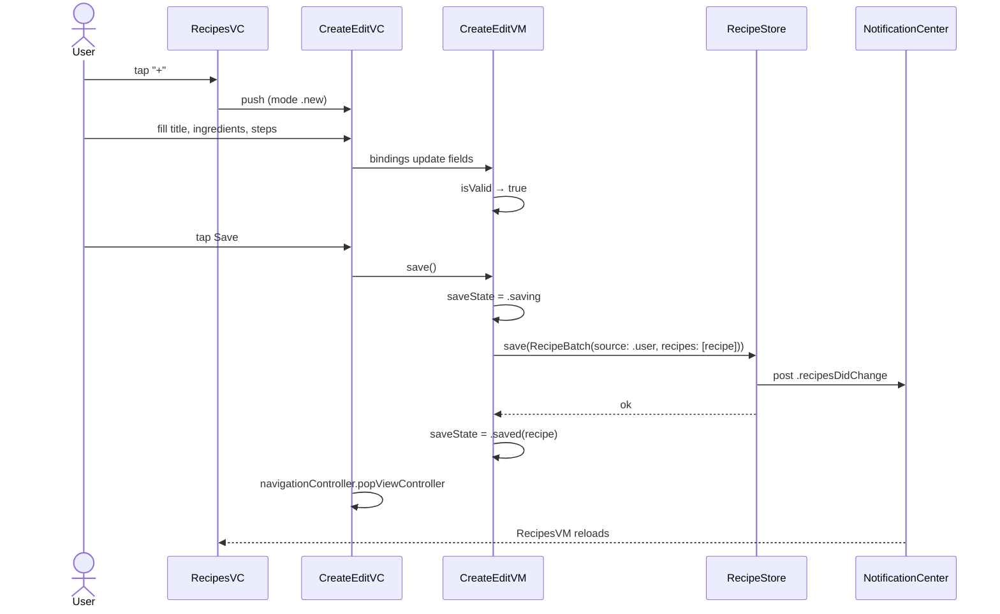
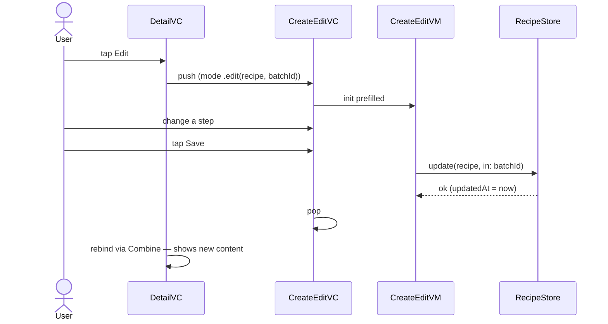
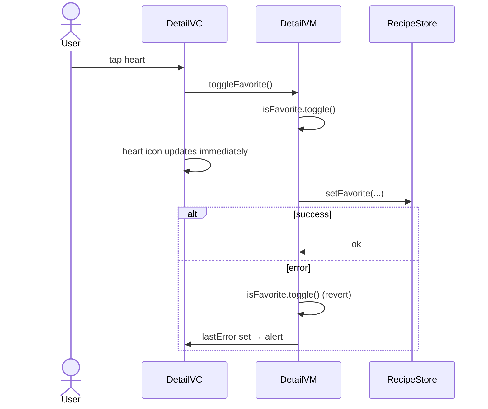
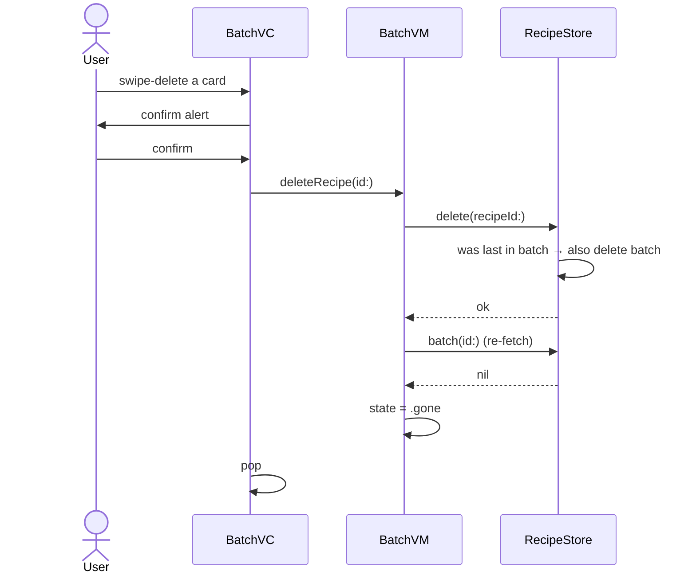

# FridgeChef — Cookbook Phase 1 Design Spec

> Turn the Recipes tab from "AI-batch history" into the start of a personal cookbook. Phase 1 adds: create your own recipe, edit any recipe (AI or user), and per-recipe favoriting with list filter. Plus the supporting deletes that become necessary the moment users can create things.

**Date:** 2026-05-19
**Branch (planned):** `feat/cookbook-phase1`, stacked on `feat/v1` after `feat/catalog-redesign` merges (or on `feat/catalog-redesign` if v1.1 hasn't merged yet — decide at implementation time)
**Out of scope for Phase 1:** tags, collections, search, share — those are Phase 2 and Phase 3, each with its own brainstorming + spec cycle.

---

## 1. Goals

- A user can create a recipe from scratch and find it in the Recipes tab.
- A user can edit any recipe — AI-generated or user-created — and the change persists.
- A user can favorite individual recipes and filter the Recipes list to favorites only.
- A user can delete single recipes or whole batches.

**Non-goals (Phase 1):**

- Tags, collections, search, share sheet — Phase 2/3.
- Photos / servings count / notes — deferred (parity with AI fields chosen during brainstorming).
- Versioning, "My version of …" duplicates — explicitly rejected; edits are in place.
- Cross-device sync — local-only stays local-only.
- Undo / trash bin — deletes are permanent (with confirmation).

---

## 2. Data model

### 2.1 Core Data — additive lightweight migration

Three new attributes. Inferred mapping; no custom migration script. Existing data fills with defaults.

```
RecipeBatchEntity
  + source: String, default "ai", non-optional

RecipeEntity
  + isFavorite: Boolean, default false, non-optional
  + updatedAt: Date, optional
```

`updatedAt` is `nil` for pre-Phase-1 rows and gets set to `Date()` on every successful `update(_:in:)` write. `nil` means "never edited" — UI displays the `createdAt` of the parent batch in that case.

### 2.2 Swift value types (`SharedModels/`)

```swift
enum RecipeSource: String, Codable, Equatable {
    case ai
    case user
}

struct Recipe: Codable, Hashable, Identifiable {
    let id: UUID
    let title: String
    let description: String
    let ingredients: [String]
    let steps: [String]
    let estimatedTime: String
    let isFavorite: Bool        // NEW
    let updatedAt: Date?        // NEW
}

struct RecipeBatch: Codable, Hashable, Identifiable {
    let id: UUID
    let createdAt: Date
    let inputIngredients: [String]
    let inputImageThumbnailJPEG: Data?
    let recipes: [Recipe]
    let source: RecipeSource    // NEW
}
```

Pre-Phase-1 Recipe call sites that construct a `Recipe` literal must pass `isFavorite: false, updatedAt: nil`. Same for `RecipeBatch`: pass `source: .ai`. Audit list (verified at spec time):

- `OpenAIClient` decoder — synthesizes `Recipe` from the JSON-schema response, sets `isFavorite = false, updatedAt = nil`. `OpenAIClient` callers build the batch with `source = .ai`.
- Stubs (`StubOpenAIClient`, `StubRecipeStore`) — update fixtures to include the new fields with defaults.
- Tests that construct fixtures — same.

### 2.3 What "a user recipe" is

> A user-created recipe is a `RecipeBatchEntity` with exactly one child `RecipeEntity` and `source = "user"`.

This deliberately reuses the existing batch concept so every list / detail view already works. There is no second list, no second table, no parallel UI. A "batch of one" is a normal batch as far as the store and the view layer are concerned.

---

## 3. `RecipeStore` API additions

```swift
@MainActor
protocol RecipeStoreProtocol {
    // Existing — unchanged
    func save(_ batch: RecipeBatch) async throws
    func allBatches() async throws -> [RecipeBatch]
    func batch(id: UUID) async throws -> RecipeBatch?
    func deleteAll() async throws

    // NEW in Phase 1
    func update(_ recipe: Recipe, in batchId: UUID) async throws
    func setFavorite(recipeId: UUID, isFavorite: Bool) async throws
    func delete(recipeId: UUID) async throws
    func delete(batchId: UUID) async throws
}
```

Behavior:

- `update(_:in:)` — finds the `RecipeEntity` by `recipe.id`, verifies it belongs to `batchId`, writes all five user-editable fields (`title`, `recipeDescription`, `ingredientsJSON`, `stepsJSON`, `estimatedTime`), sets `updatedAt = Date()`. Throws `RecipeStoreError.notFound` if the recipe isn't found or its batch ID mismatches.
- `setFavorite(recipeId:isFavorite:)` — finds by id, sets `isFavorite`. Throws `.notFound` if missing.
- `delete(recipeId:)` — finds by id, removes it. **Cascade rule:** if that recipe was the last in its batch, also deletes the batch. Throws `.notFound` if missing.
- `delete(batchId:)` — deletes the batch (Core Data cascade removes child recipes via the existing relationship deletion rule). Throws `.notFound` if missing.

Every mutating method posts `NSNotification.Name.recipesDidChange` after a successful save (existing pattern from v1). Listeners (`RecipesVM`, `SettingsVM`) reload on the next runloop tick.

`RecipeStoreError` already exists; add `.notFound` if not present.

---

## 4. New screens + nav

### 4.1 `CreateEditRecipeVC` (new)

One screen, two modes:

```swift
enum Mode {
    case new
    case edit(existing: Recipe, batchId: UUID)
}

init(vm: CreateEditRecipeVM)
```

**Layout** — vertical `UIScrollView` + `UIStackView`, paper background, 24pt outer insets, 16pt section spacing. Each section is its own `UIStackView`.

| Section | Field | Type | Constraints | Accessibility ID |
|---|---|---|---|---|
| 1 | Title | `UITextField`, `Typography.title`, single line, autocorrect on | required, non-empty after trim | `create.title.field` |
| 2 | Description | `UITextView`, `Typography.body`, 4-line min, grows up to 8 | optional | `create.description.field` |
| 3 | Ingredients | Dynamic `UIStackView` of rows | ≥1 non-empty after trim | rows tagged `create.ingredient.row.0`, `.1`, … |
| 3 | (each row) | `UITextField` + circular `−` button | tap `−` removes the row | `create.ingredient.row.<i>.field` / `.remove` |
| 3 | "+ Add ingredient" | `UIButton(type: .system)`, full-width text button, sage tint | appends an empty row at the end | `create.ingredient.add` |
| 4 | Steps | Same dynamic stack pattern but each row is a multi-line `UITextView` | ≥1 non-empty after trim | `create.step.row.<i>.field` / `.remove`, `create.step.add` |
| 5 | Estimated time | `UITextField`, `Typography.body`, placeholder "30 min" | optional, free-form | `create.time.field` |

**Nav bar** — `UINavigationItem`:
- left: Cancel (`UIBarButtonItem` system) → confirm-discard alert if `vm.hasUnsavedChanges`, else pop
- title: "New Recipe" (mode `.new`) or "Edit Recipe" (mode `.edit`)
- right: Save → `accessibilityIdentifier = "create.save.button"`, disabled until `vm.isValid`

**Visual tokens:** background `paper`, all text `ink` (`inkSoft` for placeholders + helper text), text-field borderless with bottom `rule` hairline, `−` and `+` buttons tinted `terracotta`.

**Dynamic rows behavior** — the trailing "+ Add ingredient" / "+ Add step" button always exists. Tapping it appends a new empty row above itself. Each row's `−` button is enabled only when there is more than one row total (so the user can't accidentally orphan zero inputs). On Save, empty rows are stripped.

### 4.2 `RecipesVC` additions

- `navigationItem.rightBarButtonItem` = `+` (system add) → `pushViewController(CreateEditRecipeVC(vm: vm(.new)))`. Accessibility ID `recipes.create.button`.
- Below the nav bar, in `viewDidLoad`: a `UISegmentedControl` with two segments "All" / "Favorites" pinned to safe-area-top, leading/trailing 16pt. Accessibility ID `recipes.filter.segmented`. Bound to `RecipesVM.filter` via Combine.
- Cells (`RecipesBatchCell`) — `secondaryAttributedText` already renders the date label; add a small `heart.fill` leading icon (10pt) tinted `terracotta` when **any recipe in the batch is favorited**.
- Trailing swipe action on each row — `UIContextualAction(.destructive)` titled "Delete", calls `vm.deleteBatch(id:)` after a confirmation alert.

### 4.3 `RecipeBatchVC` additions

- Cells (`RecipeBatchCardCell`) — overlay a `heart.fill` icon (12pt, `terracotta`, top-right inset 8pt) when `recipe.isFavorite`.
- Trailing swipe action on each card — "Delete" (destructive), confirm alert, calls `vm.deleteRecipe(id:)`. If the batch becomes empty, VC pops automatically (see §5).

### 4.4 `RecipeDetailVC` additions

- `navigationItem.rightBarButtonItems` (right-to-left):
  1. Heart icon (`heart` when not favorited, `heart.fill` when favorited, tint `terracotta`). Tap → `vm.toggleFavorite()`. Accessibility ID `detail.favorite.button`.
  2. "Edit" text button. Tap → `pushViewController(CreateEditRecipeVC(vm: vm(.edit(recipe, batchId))))`. Accessibility ID `detail.edit.button`.
- After a successful edit returns, `RecipeDetailVC` rebinds via Combine — the screen updates in place without a re-push.

### 4.5 No new tab

Tab bar stays at three. No "Favorites" tab, no "Create" tab.

---

## 5. ViewModels

### 5.1 New: `CreateEditRecipeVM`

```swift
@MainActor
final class CreateEditRecipeVM {
    enum Mode { case new, edit(existing: Recipe, batchId: UUID) }
    enum SaveState { case idle, saving, saved(Recipe), error(String) }

    @Published var title: String = ""
    @Published var descriptionText: String = ""
    @Published var ingredients: [String] = [""]
    @Published var steps: [String] = [""]
    @Published var estimatedTime: String = ""

    @Published private(set) var isValid: Bool = false
    @Published private(set) var saveState: SaveState = .idle

    var hasUnsavedChanges: Bool { /* computed */ }

    init(mode: Mode, store: RecipeStoreProtocol)

    func save() async
    func addIngredientRow()
    func removeIngredientRow(at index: Int)
    func addStepRow()
    func removeStepRow(at index: Int)
}
```

`isValid` is a Combine `CombineLatest5` of the five fields, mapped to:

```swift
trimmed(title).isNotEmpty
&& ingredients.contains { trimmed($0).isNotEmpty }
&& steps.contains { trimmed($0).isNotEmpty }
```

`save()` strips empty rows, constructs the value-type `Recipe`, and:

- `mode == .new` — builds a `RecipeBatch(id: UUID(), createdAt: .now, inputIngredients: [], inputImageThumbnailJPEG: nil, recipes: [recipe], source: .user)` and calls `store.save(batch)`.
- `mode == .edit` — calls `store.update(recipe, in: batchId)`.

State transitions: `.idle → .saving → .saved(recipe) | .error(message)`. Re-entering `.saving` while in `.saving` is a no-op (also UI-prevented by binding the Save button's `isEnabled` to `saveState != .saving`).

### 5.2 Existing VMs — additions

**`RecipesVM`**

```swift
enum Filter { case all, favorites }

@Published var filter: Filter = .all

// Derived (CombineLatest of groups + filter):
@Published private(set) var visibleGroups: [Group] = []
```

`visibleGroups` is `groups` with each `RecipeBatch.recipes` filtered to favorites (when `filter == .favorites`), and any batch whose recipes list becomes empty is dropped. RecipesVC binds its `UICollectionViewDiffableDataSource` (or `UITableViewDiffableDataSource`) to `visibleGroups` instead of `groups`.

Adds two methods:

```swift
func deleteBatch(id: UUID) async
```

Plus the existing notification-driven reload picks up favorite-toggle changes from other screens automatically.

**`RecipeBatchVM`**

```swift
enum BatchState { case loaded(RecipeBatch), gone }
@Published private(set) var batchState: BatchState = .loaded(initialBatch)

func deleteRecipe(id: UUID) async
```

`deleteRecipe(_:)` calls `store.delete(recipeId:)`. After the call, it re-fetches its batch via `store.batch(id:)`. If `nil` (cascade-deleted), it emits `.gone` and `RecipeBatchVC` pops via a Combine sink.

**`RecipeDetailVM`**

```swift
@Published private(set) var isFavorite: Bool
@Published private(set) var lastError: String?

func toggleFavorite() async
```

Optimistic flip:

```swift
isFavorite.toggle()
do {
    try await store.setFavorite(recipeId: recipe.id, isFavorite: isFavorite)
} catch {
    isFavorite.toggle()           // revert
    lastError = error.localizedDescription
}
```

VC binds the heart icon's `image` to `isFavorite` and presents an alert when `lastError != nil` (then clears it on dismissal).

---

## 6. Data flow diagrams

### 6.1 Create a user recipe



### 6.2 Edit any recipe



### 6.3 Favorite toggle (optimistic)



### 6.4 Delete recipe → batch cascade



---

## 7. Error handling

| Case | Behavior |
|---|---|
| `save(batch)` throws | `CreateEditVM.saveState = .error(message)`; CreateEditVC shows single-button `UIAlertController` titled "Couldn't save"; user stays on the form with all field state intact. |
| `update(_:in:)` throws | Same alert and recovery. |
| `setFavorite` throws | `DetailVM` reverts the optimistic flip + sets `lastError`; DetailVC shows alert "Couldn't save favorite — try again." |
| `delete(recipeId:)` throws | Confirmation alert was already accepted; show error alert "Couldn't delete — try again." Row stays in place. |
| `delete(batchId:)` throws | Same. |
| Empty batch detected after recipe delete | `RecipeStore` cascade-deletes batch atomically. `RecipeBatchVM` re-fetch returns `nil`, state → `.gone`, VC pops. |
| Cancel CreateEdit with `hasUnsavedChanges == true` | UIAlertController: "Discard changes?" with Discard (destructive) / Keep editing. Standard iOS pattern. |
| `hasUnsavedChanges == false` cancel | Pop immediately, no alert. |
| Migration on first launch after upgrade | Core Data lightweight inferred migration — no user-visible behavior, no spinner, no risk of failure (additive defaults only). |
| Two simultaneous saves | `CreateEditVM.save()` no-ops if `saveState == .saving`. Save button disabled when saving via Combine binding. |
| Race: edit a recipe that was just deleted on another VC | `update(_:in:)` throws `.notFound`; CreateEditVC shows error and pops back to RecipesVC. |

---

## 8. Testing

Stays in the existing pattern (XCTest + protocol stubs + in-memory `NSPersistentContainer`). No new test infra needed.

### 8.1 New test files

**`CreateEditRecipeVMTests`** — 6 tests:

1. Init in `.new` → all fields empty, `ingredients == [""]`, `steps == [""]`, `isValid == false`.
2. Init in `.edit(recipe, batchId)` → fields pre-filled from the recipe, `isValid == true`.
3. Validation: setting title only, or title + empty ingredient only, leaves `isValid == false`; title + ≥1 non-empty ingredient + ≥1 non-empty step flips to `true`.
4. `save()` in `.new` calls `store.save(batch)` once; captured batch has `source == .user`, exactly one child recipe, empty-row inputs stripped.
5. `save()` in `.edit` calls `store.update(recipe, in: batchId)` once; captured recipe carries the edited fields.
6. Store throws on save → `saveState == .error(...)`; field state unchanged.

### 8.2 Additions to existing test files

**`RecipesVMTests`** — +2:
- `filter = .favorites` → `visibleGroups` contains only batches with ≥1 favorited recipe; each remaining batch's `recipes` array contains only favorited rows.
- `filter = .all` → `visibleGroups == groups` exactly (no filtering, no drop).

**`RecipeBatchVMTests`** — +2:
- `deleteRecipe(_:)` on a 3-recipe batch → store called once with that id; batch state has 2 remaining recipes.
- `deleteRecipe(_:)` removing the last recipe → state transitions to `.gone`.

**`RecipeDetailVMTests`** — +2:
- `toggleFavorite()` happy path → `isFavorite` flips, store called once with the new value.
- `toggleFavorite()` store throws → `isFavorite` reverts to original, `lastError != nil`.

**`RecipeStoreTests`** — +5:
- `update(_:in:)` rewrites all five user-editable fields and bumps `updatedAt`.
- `setFavorite(recipeId:isFavorite:)` persists the new value.
- `delete(recipeId:)` removes one recipe from a multi-recipe batch; remaining recipes intact.
- `delete(batchId:)` removes the batch and cascades to child recipes (no orphan recipes).
- `delete(recipeId:)` on the last recipe in a batch cascades to delete the batch (batch lookup returns `nil` afterwards).

### 8.3 Smoke (XCUITest)

`SmokeTests` — +1:

- `test_recipes_create_button_visible` — Recipes tab → assert `recipes.create.button` exists; tap it; assert `create.title.field` and `create.save.button` exist on the pushed screen.

Full save and edit flows stay in `CreateEditRecipeVMTests` — XCUITest is flaky for multi-field form input with dynamic rows.

### 8.4 Stub additions

```swift
final class StubRecipeStore: RecipeStoreProtocol {
    // ... existing
    var updateCalls: [(recipe: Recipe, batchId: UUID)] = []
    var setFavoriteCalls: [(recipeId: UUID, isFavorite: Bool)] = []
    var deleteRecipeCalls: [UUID] = []
    var deleteBatchCalls: [UUID] = []
    var nextError: Error?

    func update(_ recipe: Recipe, in batchId: UUID) async throws {
        if let nextError { throw nextError }
        updateCalls.append((recipe, batchId))
    }
    // ... etc
}
```

### 8.5 Test count

**52 → 69 tests.** (66 unit + 3 smoke; the new smoke test is the +1.)

---

## 9. Accessibility

| Element | accessibilityIdentifier | accessibilityLabel | Hint |
|---|---|---|---|
| Create button | `recipes.create.button` | "Create new recipe" | "Opens a form to add your own recipe" |
| Filter segmented | `recipes.filter.segmented` | "Filter recipes" | "Show all recipes or favorites only" |
| Title field | `create.title.field` | "Recipe title" | — |
| Description field | `create.description.field` | "Description" | — |
| Ingredient row N | `create.ingredient.row.<N>.field` | "Ingredient \(N+1)" | — |
| Ingredient remove N | `create.ingredient.row.<N>.remove` | "Remove ingredient \(N+1)" | — |
| Add ingredient | `create.ingredient.add` | "Add ingredient" | "Adds an empty ingredient row" |
| (steps mirror ingredients with `create.step.*`) | | | |
| Time field | `create.time.field` | "Estimated time" | "Free-form text like '30 min'" |
| Save | `create.save.button` | "Save recipe" | "Saves and returns to the previous screen" |
| Heart in Detail | `detail.favorite.button` | "Favorite" / "Unfavorite" (toggled) | "Toggle favorite for this recipe" |
| Edit in Detail | `detail.edit.button` | "Edit recipe" | — |

---

## 10. Branching / shipping

- **Branch:** `feat/cookbook-phase1`, stacked on the v1.1 catalog redesign branch (or on `feat/v1` if v1.1 has merged by implementation start).
- **PR:** stacked PR like the catalog redesign; target `feat/v1` (or `main` if v1 has merged).
- **Phase ordering:** Phase 1 is independent of catalog redesign — they don't share code beyond the existing services. Implementation can proceed in parallel with v1.1 review if needed; merge order doesn't matter.

---

## 11. Out of scope for Phase 1 (will appear in Phase 2 / 3 specs)

| Feature | Phase | Why deferred |
|---|---|---|
| Tags | 2 | Independent schema work (Tag entity, many-to-many). Doesn't depend on Phase 1. |
| Collections | 2 | Same — separate entity, separate management UI. |
| Search | 3 | Cross-cuts AI + user recipes; cleaner once tags exist to bias the index. |
| Share to other apps | 3 | UIActivityViewController + recipe → markdown rendering. Small. |
| Photo on user recipe | later | Adds image picker + storage. Pushed to Phase 2 or beyond. |
| Servings count, notes, source URL | later | Same — additive schema, scope creep risk. |
| Drag-to-reorder recipes within a batch | later | Niche; not worth Phase 1 surface area. |
| Per-batch favoriting | rejected | Granularity decided at brainstorm: per-recipe only. |
| Duplicate-as-my-version on edit | rejected | Brainstorm picked edit-in-place. |
| Photo on user recipe (in Phase 1) | rejected | Brainstorm picked parity-only fields. |

---

## 12. Effort estimate

Roughly 2 days of focused work, in 6–8 TDD phases:

1. Schema migration + value-type field additions (incl. audit of all `Recipe`/`RecipeBatch` literal constructions in source + tests)
2. `RecipeStore` four new methods + tests
3. `StubRecipeStore` additions
4. `CreateEditRecipeVM` + tests
5. `CreateEditRecipeVC` (the new screen)
6. `RecipeDetailVC` heart + Edit nav buttons + `RecipeDetailVM` toggleFavorite
7. `RecipesVC` `+` button + segmented control + swipe-delete + `RecipesVM` filter
8. `RecipeBatchVC` heart overlay + swipe-delete + `RecipeBatchVM` deleteRecipe
9. SmokeTests + visual verification + ship

---

## 13. Open questions

None at spec time. All design decisions resolved in the brainstorming pass.
